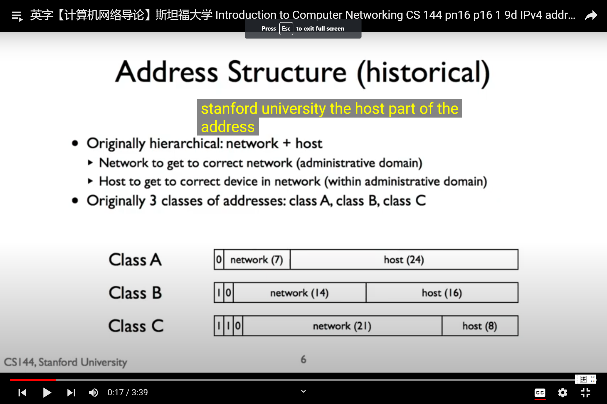

# Address Structure(historical)
Originally hierarchical: network + host
- Network to get to correct network(administrative domain)
- Host to get to correct device in network (within administrative domain)

Originally 3 classes of addresses: class A,B,C

### Address Structure Today

Still assign contiguous ranges of addresses to nearby networks 
- Class A,B,C is too coarse grained (粗略)
- http://news.stanford.edu/news/1999/january27/itss127.html
Classless Inter-Domain Routing(CIDR)
- Address block is a pair: address,count
- Counts are powers of 2, specify netmask length
- 171.64.0.0/16 means any address in range 171.64.0.0 to 171.64.255.255(16:net mask length)
- A/24 describes 256 addresses, a/20 describes 4096 addresses
- Stanford: 5/16 blocks --325000 addresses 

### IPv4 Address Assignment

IANA: Internet Assigned Numbers Authority
- Internet COrporation for Assignment of Names and NUmbers (ICANN)'s job
IANA gives out /8s to Regional Internet Registries (RIRs)
- Ran out in Feb. 2011, in special end case of giving 1 to each RIR
RIRs responsible for geographic regions, each has own policy.
AfrNIC: Africa
ARIN: USA, Canada,Carribean,Antarctica
APNIC: Asia, Australia, New Zealand
LACNIC: Latin America, Carribean
RIPE NCC: Europe, Russia, Middle East, Central Asia

2012, John Peterson , talk ,Stanford, political economic, and technical complications that this raises

### Longest Prefix Match

How does routers make decisions of each hop of the packet that travels by?

Inside each router ,there is a forwarding table that consists of a set of partial ip addresses .
123.45.x.x ->router a
then 123.45.1.1 and 123.45.20.45 will forward to router a.

If the destination does not match any of the entries in the forwarding table, it will travel through the default one.
如果有多个匹配的表项，那么选取匹配最长的那个项
0.0.0.0/0 -> 1(default)
171.33.0.0/16 ->5
