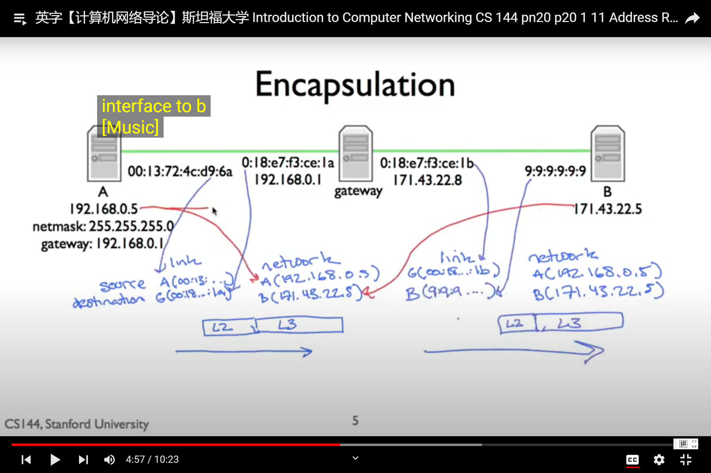

# Address Resolution Protocol(ARP)

ARP is the mechanism by which the network layer can discover the link address associated with the network address it's directly connected to.

Arp is needed because each protocol layer has its own name address, an ip address is a network level address, it describes a host a unique destination at the network layer . A link address in contrast describes a particular network kcard, a unique device that sends and receives link layer frames. Ethernet, for example , has 58-bit addresses .When you buy a ethernet card it's pre-configured in it.

Ethernet address is 48-bit, and is written as a colon-delimited set of six octets in hexdecimal such as 0:13:40:72:4c:d9:6a. It might be confusing that while these link layer and network layer addresses are completely decoupled with respect to the protocol layers, in terms of assignment and management they might not be. For example , it's common for single host to have multiple ip addresses, one for each interface. It needs to because of the concept of a net mask. 

We othen see setup like this: a gateway router has multiple interfaces each with their own link layer address to identify the card, and also each with their own network layer address to identify the hosts within the network that the card is a part of.

A:          192.168.0.5,    00:13:72:4c:d9:6a
Gateway:    192.168.0.1,    0:18:e7:f3:ce:1b,0:18:e7:f3:ce:1b
B:          171.43.22.5,    9:9:9:9:9:9

A:          192.168.0.5,    00:13:72:4c:d9:6a
Gateway:    192.168.0.1,    0:18:e7:f3:ce:1a,
Gateway:    171.43.22.8     0:18:e7:f3:ce:1b
B:          171.43.22.5,    9:9:9:9:9:9

### Example problem
How does my computer get the link-layer address of the gateway? We need to be able to map between layer 3--network layer address and layer 2--link layer address. We use the protocol called arp to do that .

Arp is a simple request reply protocol. Every node keeps a cache of mappings from ip address of its network to link address
- Generates mappings between layer 2 and layer 3 addresses
    - Nodes cache mappings , cache entries expire 
- Simple request-reply protocol
    - "Who has network address X?" "I have network address X"
- Request sent to link layer brodcast address
- Reply sent to address that sends the request(not broadcast)
- Packet format includes redundant data
    - Request has suffcient information to generate a mapping
    - Makes debugging much simpler
- No "sharing " of state: bad state will die eventually.

ARP Packet Format:
.png)
