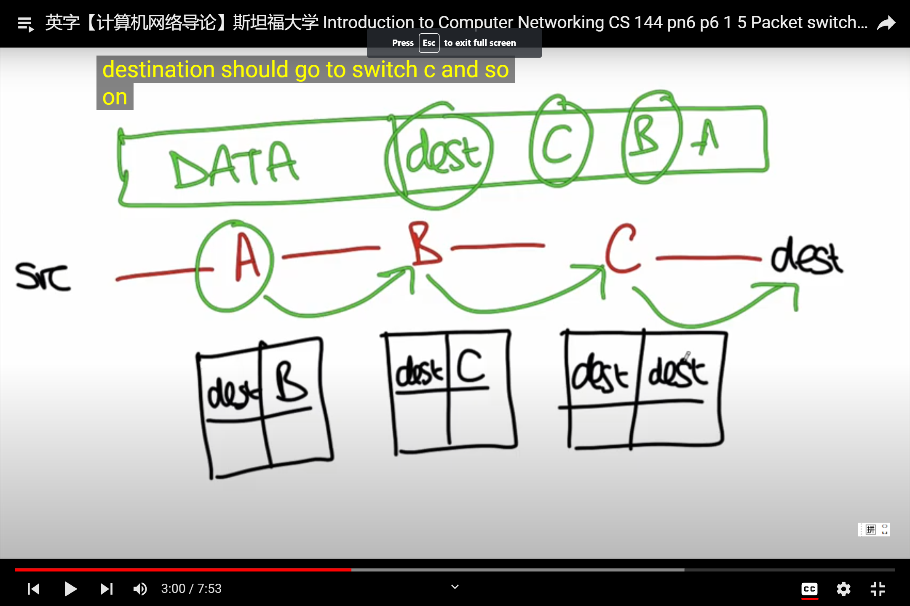

# Packet Switching

What is packet switching?
* Packet: A self-contained unit of data that carries information necessary for it to reach its destination
* Packet switching : Independent, pick outgoing link. If link is free,send it;else hold the packet for later

### self routing/source routing

C,B,A:routers that connect src and dest.

datagram:
DATA | dest | C | B | A | 

Internet supports this kind of routing, but it's generally turned off because it raises big security issues.

#### a simple optimization

router stores map between dest and next hop.
properties: 
1. Simple packet forwarding
2. Efficient sharing of links

### No per-flow state required
flow : a sequence of packets belonging to the same end-to-end communication

Packet switches dont need state for each flow - each packet is self-contained.

No per-flow state to be added/removed,no per-flow state to be stored, no per-flow state to be changed upon failure

### Efficient sharing of links
Data traffic is bursty
- Packet switching allows flows to use all available link capacity.
- Packet switching allows flows to share link capacity